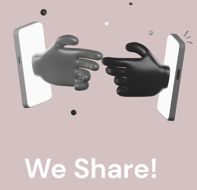

## ⚪ WeShare: an NFC application

Mobile application based on NFC tech, exchanging your own contact with other users




> This project was carried out for the Human Computer Interaction exam. Master degree in Computer Science at Sapienza - June 2022

[]() 
[](https://creativecommons.org/publicdomain/zero/1.0/) 
[](http://github.com/cezaraugusto/github-template-guidelines)

Share quickly your contact with other people by simply clicking a button and placing phones nearby. Ability to customize your profile, creating more than one, always ready when needed. Keep track of all the people you met. 📱

<br>
<p align="center">
<strong>This project includes:</strong>
<a href="/.github/README.md">README</a> • <a href="https://github.com/albertoCotumaccio/WeShare---application/tree/main/App">APPPLICATION CODE</a> • <a href="https://github.com/albertoCotumaccio/WeShare---application/tree/main/Documents">DOCUMENTATION</a></a>
</p>
<br>


## Getting Started

### Useful commands

* We used expo to work on the code, currently the sdk is at version 45, should it update use the command expo update or expo update sdk
* We strongly suggest using Visual Studio Code as your IDE and the Git Lens plugin for Visual Studio, we have been very comfortable with this setup

### Installing

* To run our project, navigate to the directory and you can use both yarn and npm (we suggest yarn to fix all possible incompatibilities between the various installed libs )
* Immediately after cloning the repo you need to run one of the following commands (depending on the handler used) to align the libraries: ```yarn or npm install```
* Then run expo start to start the expo server and run the app on a device.

### Executing program

* currently to build the app there are two tools, the native expo and the new EAS tool. We strongly suggest you use the latter since expo build will be discontinued on January 4, 2023 (184 days away). If you would still like to try both tools, just run expo build:android or use the following instructions:
* Step-by-step bullets
```
code blocks for commands
```

## Help

Any advise for common problems or issues.
```
command to run if program contains helper info
```

## Authors :thumbsup:

> Those who participated in the creation of the project are listed here

* [Alberto Cotumaccio](https://it.linkedin.com/in/alberto-cotumaccio-8b8443229?trk=people-guest_people_search-card)
* Giovanni Montobbio
* Matteo Basile
* Alessandro Di Patria
* Daniele Ciammaroni

## Version History

* 0.2
    * Various bug fixes and optimizations
    * See [commit change]() or See [release history]()
* 0.1
    * Initial Release

## License

This project is licensed under the [NAME HERE] License - see the LICENSE.md file for details

## Acknowledgments

Inspiration, code snippets, etc.
* [awesome-readme](https://github.com/matiassingers/awesome-readme)
* [PurpleBooth](https://gist.github.com/PurpleBooth/109311bb0361f32d87a2)
* [dbader](https://github.com/dbader/readme-template)
* [zenorocha](https://gist.github.com/zenorocha/4526327)
* [fvcproductions](https://gist.github.com/fvcproductions/1bfc2d4aecb01a834b46)
